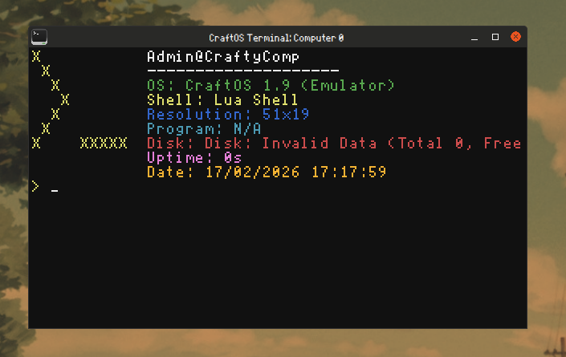

# [gbjve](https://fontstruct.com/fontstructions/show/2722233/gbjve) font for Minecraft things 


## Info
[ascii.png](font/ascii.png) is a file for minecraft itself
[gbjve-ccpc.bmp](font/gbjve-ccpc.bmp) is a file for [CraftOS-PC](https://github.com/MCJack123/craftos2)

## Instructions

### Minecraft
To install the font in minecraft, you have to put the ascii.png file in `PathToYourMinecraftInstance/minecraft/resourcepacks/YourPackHere/assets/minecraft/textures/font/` folder.
That's how it works with newer versions of minecraft.

### CraftOS-PC
To install this font to be used in CraftOS-PC, put gbjve-ccpc.bmp in a folder of your choice and make sure you change the config(`global.json`) to have:
```json
{
 "customFontPath" : "\/Path\/To\/gbjve-ccpc.bmp",
 "customFontScale" : 2,
}
```


#### The original font was created by [danil](https://gitlab.com/danil275487) this is just a port
